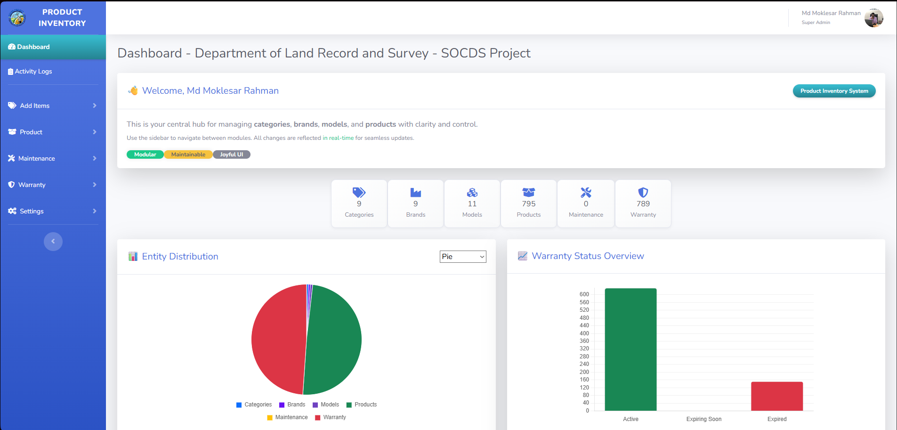
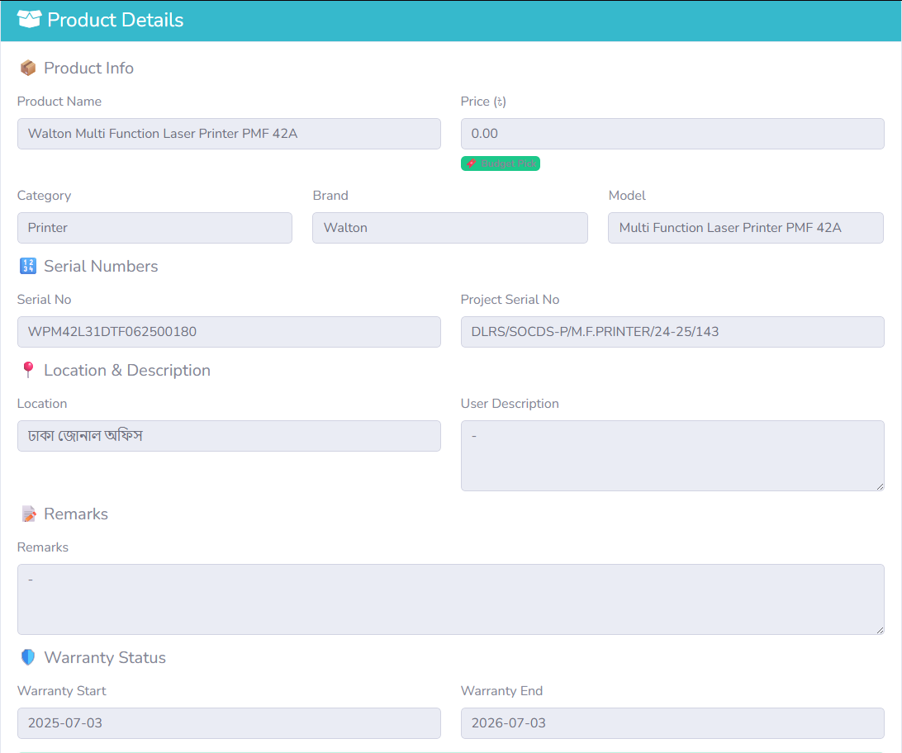
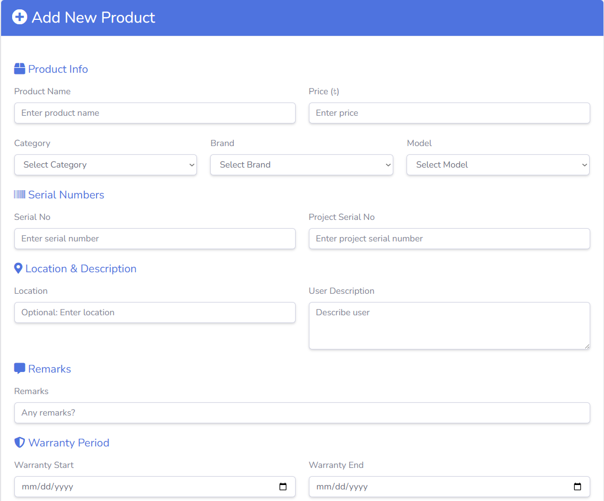

[](CHANGELOG.md)
[](docs/screenshots/README.md)

🔗 [Live Demo](https://md-moklesar-rahman-bappy.github.io/product_inventory/)

# 🧿 Product Inventory Dashboard

A vibrant, responsive Laravel application for managing products with advanced CRUD operations, dashboard-level UI polish, and robust backend logic.

---

## 📑 Table of Contents
- [Features](#-features)
- [Tech Stack](#-tech-stack)
- [Folder Structure](#-folder-structure)
- [Setup Instructions](#-setup-instructions)
- [Search Functionality](#-search-functionality)
- [Screenshots](#-screenshots)
- [Documentation](#-documentation)
- [UI/UX Highlights](#-uiux-highlights)
- [Developer Notes](#-developer-notes)
- [Credits](#-credits)
- [License](#-license)
- [Contributing](#-contributing)
- [Contact](#-contact)

---

## 🚀 Features
- 🧩 Modular CRUD for Products, Brands, Categories, and Models  
- 🔍 Search by Serial Number with pagination and highlight  
- 🎨 Beautiful dashboard UI with gradient headers, badges, and icons  
- 📦 Product creation with category, brand, model, serials, and remarks  
- 🛡️ Form validation with feedback and empty state visuals  
- 🧠 Blade components and DRY structure for maintainability  

---

## 🛠️ Tech Stack
| Layer        | Tools & Frameworks               |
|-------------|----------------------------------|
| Backend      | Laravel 10+, Eloquent ORM        |
| Frontend     | Blade, Bootstrap 5, Font Awesome |
| UI/UX        | Custom CSS, gradient buttons     |
| Database     | MySQL / MariaDB                  |

---

## 📁 Folder Structure
├── app/ │   ├── Models/ │   ├── Http/Controllers/ │   └── Requests/ ├── resources/ │   ├── views/ │   │   ├── products/ │   │   ├── brands/ │   │   ├── categories/ │   │   └── models/ │   └── layouts/ ├── routes/ │   └── web.php


---

## ⚙️ Setup Instructions
1. **Clone the repo**
   ```bash
   git clone https://github.com/your-username/product-inventory-dashboard.git
   cd product-inventory-dashboard
   ```

2. **Install dependencies**
   ```bash
   composer install
   npm install && npm run dev
   ```

3. **Environment setup**
   ```bash
   cp .env.example .env
   php artisan key:generate
   ```

4. **Database migration**
   ```bash
   php artisan migrate
   ```

5. **Run the server**
   ```bash
   php artisan serve
   ```

🔍 Search Functionality
- Search by serial number from the product index page
- Pagination retains search query
- Matching serials are highlighted using <mark>
- Clean UI with instant feedback

📸 Screenshots




📖 Documentation
## 📖 Documentation
- [UI Guidelines](docs/ui-guidelines.md)
- [Architecture](docs/architecture.md)
- [Roadmap](docs/roadmap.md)
- [Changelog](docs/changelog.md)

✨ UI/UX Highlights
- Gradient buttons with hover effects
- Font Awesome icons for actions
- Tooltips for clarity
- Empty states with illustrations and messages
- Consistent color palette across modules
- Responsive layout for desktop and mobile

🧠 Developer Notes
- Uses Laravel resourceful routing and route model binding
- Form requests handle validation cleanly
- Blade components for buttons, alerts, and form inputs
- Foreign key constraints enforced in migrations
- Modular design for scalability and maintainability
- GitHub Actions workflow runs tests automatically on push/PR
- Releases are automated via tags and changelog integration

🙌 Credits
Crafted with ❤️ by Md Moklesar Rahman
Laravel architect & UI/UX designer
Focused on beauty, clarity, and backend precision.
📧 Email: md.moklasarrahmanbappy@gmail.com

📜 License
This project is open-source under the [MIT License](LICENSE.md).

🤝 Contributing
Please see [CONTRIBUTING.md](CONTRIBUTING.md) for guidelines.
- Bug reports: use the [Bug Report Template](.github/ISSUE_TEMPLATE/bug_report.md)
- Feature requests: use the [Feature Request Template](.github/ISSUE_TEMPLATE/feature_request.md)
- Pull requests: follow the [PR Template](.github/pull_request_template.md)

📬 Contact
For feedback, suggestions, or collaboration, feel free to reach out via email or GitHub.

